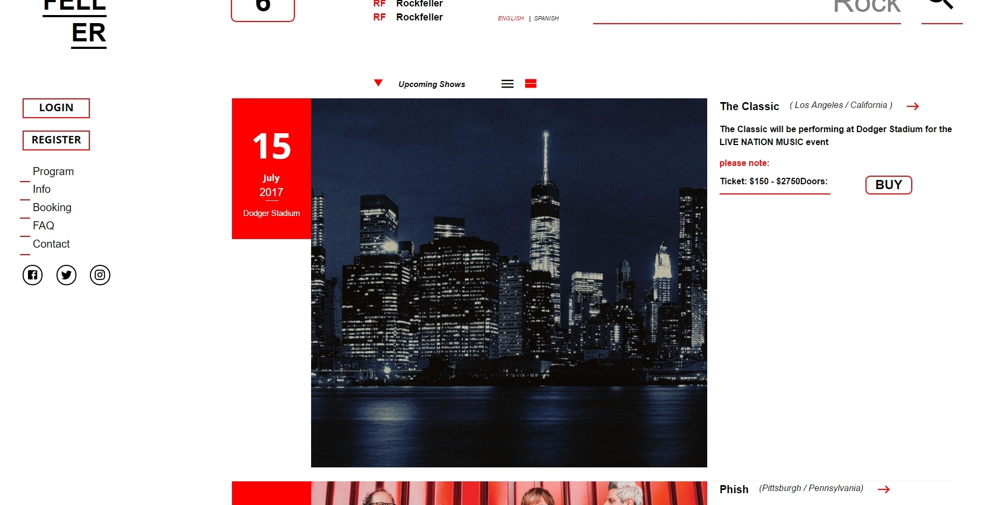
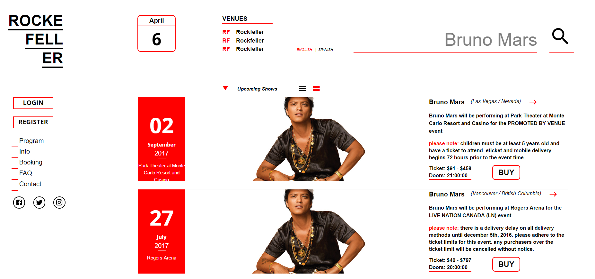
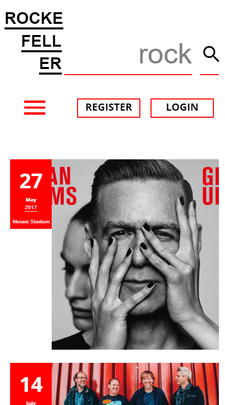

# :musical_score: Rockfeller: 

## Overview

This is a full web application built on react, it allows users to search
tickets from ticketmaster.

Its my first attempt at making a huge website for production with a large user base in mind. 

Although the application is far from finish you can view a small demo here
[here](https://rockfeller.herokuapp.com/).

## Homepage

## Functionality
On the Front End, the app uses `React` JavaScript Framework with `React Router` and `Redux`. And for styling, `styled-components` so our styling only loads with its respective react component.

On the Back End, the app uses `NodeJS`. For the database I am using `postgreSQL`. Naturally, `Express` is used as the router, and `bcrypt-js` for hashing user passwords. Additionally I am using `redux-saga` that allows for manipulation of the api data from `ticketmaster`.

## Cloning down the repo
If you wish to clone the app down to your local machine...
  1. Ensure that you have postgreSQL set up on your laptop as well as Node.
  2. The database is called Rockfeller, more info can be found in the `knexfile` in the root of the project.
  3. Once you are set up, `cd` into this repo and run `npm install`.
  4. Afterward, run `npm start`.
  5. Then, navigate to `localhost:3000` in your browser.

## Screenshots

### Search for any events

### Animation made easy with react

### Search for tickets of your favorite artist

### Mobile Look

## Current version details
    The web application is far from finish so there might still be bugs on the demo. Additionally there are still a ton of features to be added.

## Future Updates
  1. User profile, that shows friendlist, shows attended, and favorited.
  2. Ability to add friends and insta message them.
  3. Top upcoming popular shows.

## Tech used

    "axios": "^0.15.3",
    "babel-plugin-add-module-exports": "^0.2.1",
    "babel-polyfill": "6.20.0",
    "bcryptjs": "^2.4.3",
    "bcrypt": "1.0.2",
    "bluebird": "^3.5.0",
    "body-parser": "^1.17.1",
    "bookshelf": "^0.10.3",
    "chalk": "1.1.3",
    "compression": "1.6.2",
    "cross-env": "3.1.3",
    "express": "4.14.0",
    "fontfaceobserver": "2.0.7",
    "immutable": "3.8.1",
    "intl": "1.2.5",
    "invariant": "2.2.2",
    "ip": "1.1.4",
    "jsonwebtoken": "^7.3.0",
    "knex": "^0.12.9",
    "lodash": "4.17.2",
    "material-icons": "^0.1.0",
    "minimist": "1.2.0",
    "pg": "^6.1.5",
    "react": "15.4.1",
    "react-dom": "15.4.1",
    "react-fontawesome": "^1.5.0",
    "react-helmet": "3.2.2",
    "react-intl": "2.1.5",
    "react-redux": "4.4.6",
    "react-router": "3.0.0",
    "react-router-redux": "4.0.6",
    "react-router-scroll": "0.4.1",
    "redux": "3.6.0",
    "redux-form": "^6.6.0",
    "redux-immutable": "3.0.8",
    "redux-saga": "0.14.0",
    "redux-thunk": "^2.2.0",
    "reselect": "2.5.4",
    "sanitize.css": "4.1.0",
    "styled-components": "1.1.2",
    "validator": "^7.0.0",
    "warning": "3.0.0",
    "whatwg-fetch": "2.0.1"

## Authors

* **Gerardo Mestanza** - *Solo Project* - [GerardoM](https://github.com/Gmes23)
